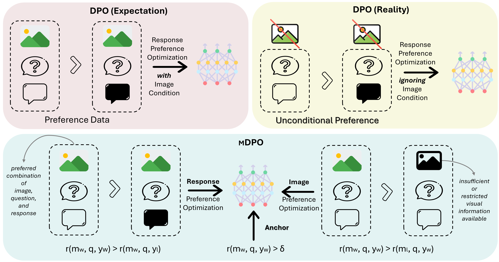

# Multimodal Direct Preference Optimization (mDPO)

[mDPO: Conditional Preference Optimization for Multimodal Large Language Models](https://arxiv.org/pdf/2406.11839) (published at EMNLP 2024).

[**🌐 Homepage**](https://feiwang96.github.io/mDPO/) | [**📖 Paper**](https://arxiv.org/pdf/2406.11839) | [**💻 Code**](https://github.com/luka-group/mDPO) | [**🤗 Dataset**](https://huggingface.co/datasets/fwnlp/mDPO-preference-data) 




## Updates
* 🔥 [2024-09-04] Initial release of the [mDPO trainer](mdpo_trainer.py). We are currently working on releasing the code for training and evaluating different models.

## Installation
TBD

## Training
Our training data is available at [this link](https://huggingface.co/datasets/fwnlp/mDPO-preference-data).

To train Bunny with mDPO, use the following command:
```bash
python bunny/run_mdpo_bunny.py
```

## Evaluation
TBD

## Citation
Please cite the following paper if you find the repo helpful:
```
@article{wang2024mdpo,
  title={mDPO: Conditional Preference Optimization for Multimodal Large Language Models},
  author={Wang, Fei and Zhou, Wenxuan and Huang, James Y and Xu, Nan and Zhang, Sheng and Poon, Hoifung and Chen, Muhao},
  journal={arXiv preprint arXiv:2406.11839},
  year={2024}
}
```
